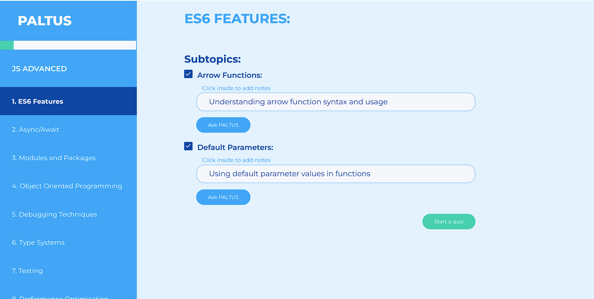

<div align="center">
  <h1> 🧠📅 PALTUS - Personalized Adaptive Learning & Time Utilization System</h1>
  <p><strong>AI-Powered Self-Learning Planner</strong></p>
</div>
<p align="center">
  <a href="http://paltus-edu.ru" target="_blank">
    
  </a>
</p>

---
An AI-powered self-learning planner that helps users create personalized study plans for any topic, using AI-model to generate lessons, mantain notes to them, and track progress with gamification to maintain engagement. User can add a course using AI-model interaction: user writes that he wants to learn some discipline, adds amount of lessons and available time, then AI-model generates a full course depending on user’s preferences and requested topic. The main goal - courses are built to fit user’s comfort and free time. Lessons include an option to edit the course model or lesson topics, add notes on each lesson, ask AI about the topic, and check the knowledge with quiz generated.

> 🧩 Everything is fully customizable: lesson titles, durations, and more. For each subtopic, users can interact with the AI for feedback, clarification, or course updates.

---


## ✨ Features

### 🔐 User Authentication
- Email verification system  
- JWT-based authorization  
- Password encryption

### 📚 Course Management
- AI-powered course generation via **GigaChat API**  
- Course editing, saving, and deletion  
- Hierarchical structure of the course: Lessons → Subtopics  

### 🧠 Learning System
- Subtopic completion tracking  
- In-lesson note-taking  
- Quiz generation per topic  
- Session-based chat with AI  

### 📈 Progress Tracking
- Last activity tracking  
- Achievement system  
- XP and level-up mechanics  

---
 

## 🚀 Getting Started

### 📋 Prerequisites
- **Node.js** `v18+`
- **Java JDK** `17`
- **PostgreSQL** `14+`

### 🛠️ Setup

1. Get a [GigaChat API key](https://developers.sber.ru/portal/gigachat-and-api)
2. You will need a password for the email to register.
3. Copy and configure the environment file:  
   ```bash
   cp .env.example .env
   ```
4. Run the application:
   ```bash
   docker compose --profile prod up --build -d
   ```

---

## 🧪 Tech Stack

### Frontend
- **Vue 3** + Composition API  
- **Pinia** (state management)  
- **Axios** (HTTP requests)  
- **CSS** (styling)

### Backend
- **Java 17**, **Spring Boot 3**
- **Spring Security**, **JWT**
- **PostgreSQL**
- **GigaChat API** (AI integration)
- **Lombok**, **MapStruct**, **Jsonrepair**
- **Springdoc-openapi** (API docs)
- **Maven** (build)

### DevOps & Infrastructure
- **Docker**
- **Docker profiles** (to mantain dev and prod version of frontend)
- **GitHub Actions** (CI/CD: build, test, deploy)

### Testing
- **JUnit 5**
- **Spring Boot Test**
- **Integration Tests**

---

## 📸 UI / Demo / Screenshots

- 🎨 [Figma Design](https://www.figma.com/design/rvNoC6oOC2Xe5y7yWIhLuN/Demo-visuals?node-id=0-1&p=f&t=3HySqTnuZp6DQNiC-0)  
- 🖥️ [Demo](#)  
- 🖼️ **Screenshots**:
  - Login page
     
  - Home page
    
  - Course page
    
  - Quiz page
    
  - Ask AI modal
    
  - Course creation page
    
  - Achievements page
    

---

## 📄 License

This project is licensed under the **MIT License**.  
See [LICENSE](./LICENSE) for details.

---

<div align="center">
  
  
  
  
  
  
  
  
</div>
